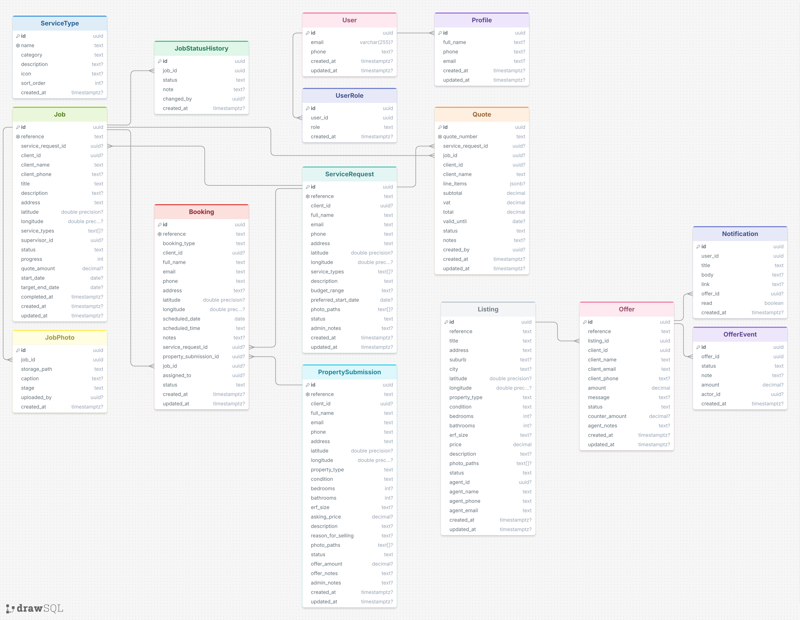

# Prop3000 Portal

**Blueprint Developers Crew · INSY7315 · Task 2**

Prop3000 Portal is the lead-to-job and property-offer platform for **Prop3000 Developers & Investments**, a Cape Town renovation, building and cash-property business. It replaces phone calls and WhatsApp threads with one portal: homeowners request quotes, sell property for cash and book site visits; buyers make offers on listings; and office staff, agents, site supervisors and the owner each run their part of the pipeline from a role-specific dashboard.

**Live site:** <LIVE URL>

## Features

- **Public site** — Home, Developers (services), Investments (cash sales), Contact, built to the client's design handoff.
- **Public forms** — request a quote, sell for cash, book a date. Validated with react-hook-form + zod, photo upload with on-device compression, no account needed, confirmation card with a reference number.
- **Listings** — live Mapbox map with price-label pins; search, price-band and type filters drive the map and list together; listing detail with spec strip, route finder and offer submission.
- **Role-based portal** — one sign-in, and your role decides where you land:
  - **Client** — quote approvals, requests, bookings, and offers with counter-offer accept/decline.
  - **Admin** — lead triage, convert-to-job (job + lead status + status history + client notification), property submissions, booking diary.
  - **Agent** — offer console with approve / counter / decline and a full offer-event audit trail; listing management.
  - **Supervisor** — assigned jobs with progress slider, status updates, private site photos and site notes.
  - **Owner** — read-only business analytics.
- **Notifications** — in-app alerts with unread count, raised by database triggers.
- **Security** — 48 row-level-security policies, mirrored in Firestore and Storage rules and covered by 26 automated rule tests.
- **Accessibility** — responsive from 390px to desktop, keyboard operable, labelled inputs with linked error messages, WCAG AA contrast.

## Tech stack

| Area | Technology |
|---|---|
| Framework | TanStack Start (file routes in `src/routes/`), React 19, TypeScript |
| Styling | Tailwind CSS v4, shadcn/ui, design tokens in `src/styles.css` |
| Data | TanStack Query; Supabase (Postgres, Auth, Storage) with Firebase migration in progress |
| Maps | Mapbox GL |
| Hosting | Cloudflare Workers |
| CI/CD | GitHub Actions |

## Entity Relationship Diagram

[](docs/Database/prop3000-erd.webp)

13 tables, relationships and indexes are defined in `supabase/migrations/`.

## Getting started

### Prerequisites

- Node.js 20
- Docker Desktop (for the local Supabase stack)
- Java 17 (only for the Firebase emulators and rule tests)

### Install and run

```bash
npm install
cp .env.example .env      # then fill in the values (see below)
npx supabase start        # Postgres, auth and storage in Docker, migrations applied
npm run dev               # http://localhost:8080
```

To load the demo data, or reset it:

```bash
npx supabase db reset
```

`npx supabase status` prints the local URL and keys for `.env`. `npx supabase stop` shuts the stack down.

### Environment variables

| Variable | Purpose |
|---|---|
| `VITE_SUPABASE_URL`, `VITE_SUPABASE_PUBLISHABLE_KEY` | Browser access to Supabase |
| `SUPABASE_URL`, `SUPABASE_PUBLISHABLE_KEY` | Server functions and SSR |
| `SUPABASE_SERVICE_ROLE_KEY` | Server only — seeds the demo accounts |
| `VITE_MAPBOX_PUBLIC_TOKEN`, `MAPBOX_ACCESS_TOKEN` | Maps and route lookups |
| `VITE_FIREBASE_*` | Firebase web config (public by design) |
| `VITE_FIREBASE_EMULATORS` | `true` to use the local Firebase emulators |

Never commit `.env`.

### Demo accounts

All demo accounts use the password **`Prop3000#2026`**, and one-click sign-in is available on `/auth`.

| Role | Email |
|---|---|
| Client | client@prop3000.demo |
| Admin | admin@prop3000.demo |
| Agent | agent@prop3000.demo |
| Supervisor | supervisor@prop3000.demo |
| Owner | owner@prop3000.demo |

### Local ports

| Port | Service |
|---|---|
| 8080 | The app |
| 54321 | Supabase API |
| 54323 | Supabase Studio |
| 8081 | Firestore emulator |
| 4000 | Firebase emulator UI |

## Build and test

```bash
npm run lint              # ESLint
npx tsc --noEmit          # type check
npm run build             # production build for Cloudflare Workers
npm run emulators         # Firebase emulators (second terminal)
npm run test:rules        # the 26 security-rule tests
```

CI runs lint, the type check, the build and the rule tests on every pull request. Merging to `main` deploys to production.

## Contributing

1. Branch off the latest code: `git switch main && git pull && git switch -c <type>/<name>`.
2. Use prefixes `feature/`, `fix/`, `chore/` or `docs/` — one topic per branch.
3. Before opening a pull request: lint, type check and build pass; attach screenshots at 1280px and 390px for visual changes.
4. Use design tokens, never hex values, in components. Statuses go through `<StatusBadge>`, money through `money()`, dates through `shortDate()`, and contact details come from `COMPANY`.
5. Open the pull request, get a review, let CI pass, then merge. Never force-push shared history.


| Khumo | Tech lead and reviewer — architecture, database, security model, design system |
| Leah Joubert | Application developer — screens, portal dashboards, forms, listings, accessibility |
| Kenan | Platform and quality — GitHub migration, CI/CD, hosting, seed data, Firebase migration, documentation |
