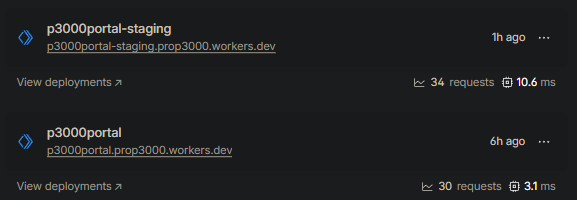

# Hosting Rationale

The Prop3000 Portal requires a hosting configuration that supports public availability and controlled development. Therefore, our implementation separates application hosting from the backend services and makes use of isolated staging and production environments. The respective environment deployments are automated through GitHub Actions.

Prop3000 is built using TanStack Start. This produces a server-side application bundle deployable via a server-side runtime. The build process generates application server output and assets that are then deployed to Cloudflare Workers. This approach enables the same platform to handle the rendered application, routes, and static assets without a traditional web server.

The TanStack Start bundle is executed within Cloudflare Workers' runtime, with public assets served statically alongside. The deployment configuration is defined in `wrangler.jsonc`, consisting of the Worker's entry point, asset paths, compatibility settings, and staging / production environments.

The application makes use of Firebase to manage application services used by the portal. This includes:

- Firebase Authentication for sign-in
- Firestore for application data
- Firebase Storage for uploaded files

The Firebase project configuration is passed to the frontend at build time, with Firebase Security Rules used to safeguard Firestore and Storage access.

Prop3000 maintains two hosted environments with separate Firebase projects.

Prop3000 stores service-account keys and environment variables in GitHub and/or Cloudflare secrets. Sensitive values are never committed to the repository. Credentials used for staging and production are isolated, and local Firebase emulation is not used in deployed environments.

In conclusion, the use of Cloudflare Workers and Firebase in combination leads to a lightweight, yet robust and maintainable hosting model. Cloudflare handles application hosting and delivery, with Firebase responsible for managing authentication, data, and storage services. Separating the staging and production environments mitigates deployment risk, further enhancing the CI/CD pipeline through GitHub Actions.